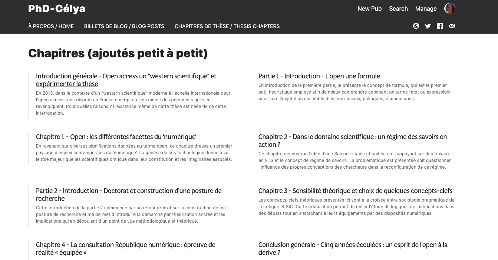

Suite à la publication de l'ouvrage « [Mind the Gap](https://mindthegap.pubpub.org/) » : analyse de l'usage d'outils/plateformes open source au sein de l'édition scientifique, j'ai découvert le site [PubPub](https://www.pubpub.org/) développée par le MIT. Plateforme elle-même en _open source_, cet outil permet de rédiger des Pub (publications) et de les agencer de différentes manières. Les publications combinées peuvent ainsi donner lieu à un livre, servir de base à une revue. La plateforme peut aussi être utilisée comme carnet de laboratoire ou site d'une conférence. PubPub se positionne avant tout comme une interface au service de communautés d'où une une dimension collaborative aussi bien pour l'écriture que pour la relecture. Outre la possibilité de contribuer à plusieurs sur une même pub.lication, il est également possible de commenter/annoter l'article.
Autre fonctionnalité que j'ai appréciée, le fait de pouvoir écrire directement en markdown. D'un point de vue technique, pour les habitué.e.s de git, la plateforme reprend les modalités de suivi de version  (push/commit). Au niveau économique, il s'agit d'un modèle freemium offrant des fonctionnalités supplémentaires (nome de domaine propre, soutien ) pour répondre aux besoins d'instituts et de communautés.  Le principe est aussi de faire payer la fermeture d'un contenu. Publier  sous licence CC0 ou CCBY est la référence, apposer une autre licence est payant. Bémol, j'aurai bien voulu que la licence CC-BY-SA soit aussi considérée comme option de base. PubPub propose aussi des fonctions propres à l'édition scientifique (DOI, metrics, etc.).

Voici pour la brève description. PubPub a répondu à des besoins que je me posais lors de la rédaction de ma thèse (écriture en markdown et commentaires possibles pour la relecture). L'été 2018 (avant la sortie de PubPub), j'avais rédigé ma thèse en markdown (avec un plugin Atom pour ajouter les références Zotero) mais j'avais tout basculé sur sur Google Doc (export via Pandoc) pour faciliter la relecture collective. Un fail pour moi qui aurais souhaité rester sur une chaine éditoriale ouverte.

A charge de revanche puisque l'été 2019 post-thèse plus paisible, m'a permis d'expérimenter PubPub pour répondre aux enjeux d'accessibilité d'une thèse (cf. ce billet). J'ai crée un espace HackYourPhD en français et en anglais avec d'une part mes chapitres de thèse et d'autre part la rédaction de quelques articles de blog en lien avec son contenu.

Pour y accéder c'est [ici](https://phd-cgd.pubpub.org/). Tous commentaires sont les bienvenus.
