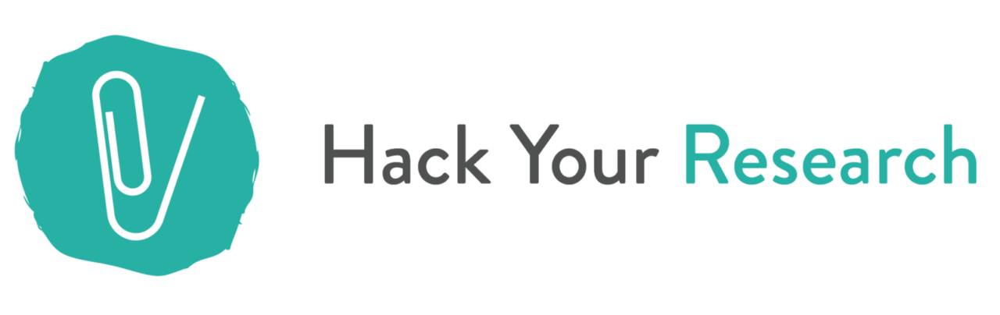
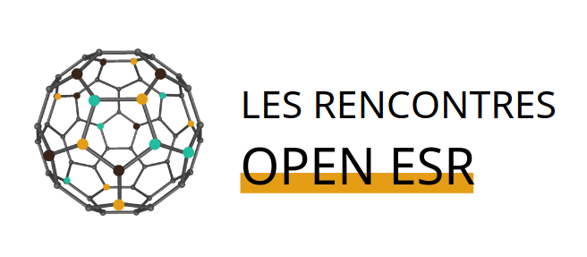

*Click ! and go directly to the french or the english version*

1. [Français](#français)
  - [HackYourResearch](#hackyourphd)
  - [OpenESR](#openESR)
  - [Inno3](#inno3)
2. [English](#english)
3. [Presentations](#presentations)

### Français 

Cette page récapitule différents projets associatifs et entreprenariaux en cours ou déjà réalisés afin d'explorer les contours de l'enseignement supérieur et de la recherche (ESR), de la production des savoirs dans des sociétés numérisées et soumises à de nouvelles barrières "enclosures" de plus en plus subtiles et qu'il s'agit de questionner.

Ces projets sont inclus dans des démarches de recherche-action, c'est-à-dire qu'ils s'inscrivent dans l'action, le _hack_ en tant qu'approche de contournement pour tester/expérimenter des modèles alternatifs (_open_, communs) au sein de nos régimes de savoirs tout en s'appuyant sur une approche réflexive et des épistémologies situées.

## HackYourPhd -> HackYourResearch 

J'ai cofondé [HackYourPhD](http://hackyourphd.org/) une communauté *Open Science* en janvier 2013 avec [Guillaume Dumas](http://www.extrospection.eu/) chercheur en sciences cognitives. HackYourPhD s'est structuré en association (loi 1901) en Août 2014 et a proposé pendant plusieurs années une veille à ce sujet, des formations à la programmation pour la recherche.

En 2020, HackYourPhD est devenu [HackYourResearch](http://hyr.science/) pour plusieurs raisons. L'_open science_ telle que nous l'explorions à ses débuts a pris un tournant institutionnel à partir de 2018. Les formations et la veille que nous faisions sur les outils numériques, les pratiques à acquérir pour une recherche plus reproductible, de qualité, etc. ont peu à peu été couvertes par les établissements de recherche et les universités. Mais il est apparu que nos questionnements sur l'Enseignement et la Recherche et la manière dont les savoirs sont produits, diffusés, réappropriés restaient toujours d'actualités. C'est pour cela que HackYourResearch est né afin de continuer à proposer un espace d'exploration et d'expérimentation sur nos façons d'éprouver la recherche et nos rapports aux savoirs comme communs.

**Association en dormance à partir de 2021**

### Nos missions

HackYourResearch :

- partager des  **actualités sur l'open science, l'Enseignement Supérieur et la Recherche** par le biais d'une veille collaborative sur les réseaux sociaux, principalement [Facebook](https://www.facebook.com/groups/hackyourresearch/) et [Twitter](https://twitter.com/hackresearch) ;

- organiser **des évènements** en France, notamment des ateliers introductifs et des débats sur l'*open science* (cf. notre page événement en [français](http://hackyourphd.org/evenements/) et en [anglais](http://hackyourphd.org/en/event/)). Nous avons mené des **ateliers de formation au code** (python) [Open Geek](https://github.com/HackYourResearch/ateliers-open-geek)

- produire des **contenus en ligne** pour faire découvrir différentes facettes de l'*open science* et les différents profils qui y participent. Le blog HackYourResearch contient divers articles, interviews mais aussi des formats plus originaux pour communiquer à ce sujet (e.g. [flyers](http://hackyourphd.org/en/flyers/)), [ebook](http://hackyourphd.org/wp-content/uploads/2016/04/Ebook_Final_VF_LD.pdf). Nous avons interviewé plus d'une soixantaine de personnes dont les propos sont disponibles sur [Archive.org](https://archive.org/details/@hackyourphd)

<figure>
    
</figure>

### Quelques évènements et ateliers organisés

- 2021 [Remix ta thèse : des souris et des profs](https://openlaw.fr/blog/retour-sur-latelier-2040-des-souris-et-des-profs)

- 2021 [Participation au GT Science Ouverte & Société du CIS (Centre Internet & Société)](https://cis.cnrs.fr/science-ouverte-et-societe/)

- 2020 [Participation à la rédaction du mémorandum Covid-19 : pour du libre et de l'open en conscience](https://covid19-open.frama.io/memo/)

- 2020 [Sprint de traduction collaborative](https://hyr.science/2020/05/26-06-20-nouvelle-date-et-nouveau-format-100-en-ligne-pour-le-sprint-dedition-et-de-traduction-collaborative-science-ouverte/) avec l'URFIST de Bordeaux

- De 2015 à 2017 : [Ateliers Open Geek](http://hackyourphd.org/ateliers-open-geek/) .
- En décembre 2015 [Hackathon HackRepNum 2015](http://hackyourphd.org/2015/11/hackrepnum-un-hackathon-recherche-autour-de-la-loi-sur-le-numerique-samedi-12-decembre-a-la-paillasse/)

## À la rencontre des acteurs de l'*open science* et des communs

Depuis 2013, donner la parole à celles et ceux qui participent à façonner le régime des savoirs dans lequel nous nous trouvons a été une ligne directrice. Cela a pris la forme d'enquêtes ethnographiques participatives et ouvertes évoluant au fil des années, mais toujours dans l'idée de montrer la diversité d'actions à l'oeuvre autour de formules telles que _open_ et communs.

### OpenESR 

En 2020, avec inno3 et HackYourResearch, un temps d'échange (webinaires) a été initié. L'objectif était d'inviter différentes personnes impliquées dans des projets sur les communs et l'_open_ (au sein de la recherche ou en dehors) afin d'apprendre de ces expériences et porter un regard réflexif sur ce que "pourrait être" l'enseignement supérieur et la recherche aujourd'hui.
Le [site OpenESR](https://openesr.frama.io/rencontres) est dédié à ces rencontres.

<figure>
    
</figure>

### HackYourPhD USA et Québec (2013-2015)

Avec HackYourPhD, avant le début de mon doctorat, j'avais débuté une première exploration de la thématique *Open Science* / Science ouverte [au Québec](http://hackyourphd-quebec.strikingly.com/) puis aux Etats-Unis. Durant l'été 2013, j'ai réalisé un grand tour des USA pour rencontrer des acteurs clefs de l'*Open Science* et mieux comprendre les racines de ce mouvement. Ce projet [HackYourPhD aux States](http://hackyourphd-aux-states.strikingly.com/) a été financé par une campagne de financement participatif (*crowdfunding)*.

#### Livre : Portraits de jeunes chercheurs de la génération #OpenScience (2015)

Un livre a été publié en ligne suite au voyage HackYourPhDUSA. Il est disponible en [français](http://hackyourphd.org/wp-content/uploads/2016/04/Ebook_Final_VF_LD.pdf) et en [anglais](http://hackyourphd.org/wp-content/uploads/2016/04/Ebook_Final_ENG-ld.pdf)

#### Interviews _Open Science_

Découvrez plus de 80 interviews sur le profil HackYourPhD d'[archive.org](https://archive.org/hackyourphd)

## Inno3 (2020-...) 

En 2019, j'ai rejoint le cabinet de conseil [inno3](https://inno3.fr/) spécialisé en innovation ouverte, _open data_ et _open source_ . Fondé par le juriste Benjamin Jean, nous accompagnons différents acteurs (établissements publics, entreprises, collectivités) à saisir les grands enjeux organisationels, juridiques, techniques qu'implique l'adoption du "numérique" et cela en employant des modèles ouverts et orientés vers la création de communs. J'y mène au côté d'une équipe dynamique des projets de recherche-action ancrés dans les valeurs du libre et des communs.

### DRISS : _Digital Research in Science & Society_ (2019-2020)

En 2019, j'ai crée avec Constance de Quatrebarbes une société [DRISS](https://driss.org/) (_Digital Research in Science & Society_). En premier lieu, cela nous a permis d'offrir des formations auprès d'universités et d'écoles de l'ESR. Ces formations modulaires et ancrées dans des immersions pratiques ont pour objet de donner des clefs de compréhension de l'_open_ et de la _data science_ tout en développant un regard critique et réflexif sur les transformations qu'apporte le numérique.

------

### English 

This page summarizes various associative and entrepreneurial projects in progress or already completed in order to explore the scope of higher education and research (HRE), of knowledge production in digitalized societies and subjected to new "enclosures" barriers that are increasingly subtle and that need to be questioned.

These projects are included in action-research approaches, i.e. they are part of the _hack_ as a counter-action approach to test/experiment alternative models (_open_, common) within our knowledge regimes while relying on a reflexive approach and situated epistemologies.

## HackYourPhd -> HackYourResearch 

I co-founded [HackYourPhD](http://hackyourphd.org/) an *Open Science* community in January 2013 with [Guillaume Dumas](http://www.extrospection.eu/) a cognitive science researcher. HackYourPhD has been structured as an association (law 1901) in August 2014 and has offered for several years a watch on this subject, training in programming for research.

In 2020, HackYourPhD became [HackYourResearch](http://hyr.science/) for several reasons. The _open science_ as we initially explored it took an institutional turn in 2018. The training and monitoring that we were doing on digital tools, on the practices to achieve more reproducible, quality research, etc. were gradually covered by research institutions and universities. But it appeared that our questions on Education and Research and the way in which knowledge is produced, disseminated and reappropriated were still relevant. That's why HackYourResearch was born in order to continue to offer a space for exploration and experimentation on our ways of experiencing research and our relationship to knowledge as common.

**Not anymore active since 2021** 

### Our missions

HackYourResearch :

- sharing **news on open science, higher education and research** through a collaborative watch on social networks, mainly [Facebook](https://www.facebook.com/groups/hackyourresearch/) and [Twitter](https://twitter.com/hackresearch) ;

- organises **events** in France, including introductory workshops and debates on *open science* (see our events page in [French](http://hackyourphd.org/evenements/) and [English](http://hackyourphd.org/en/event/)). We have conducted **code** (python) training workshops [Open Geek](https://github.com/HackYourResearch/ateliers-open-geek)

- produces **online content** to help people discover different aspects of *open science* and the different people involved. The HackYourResearch blog contains various articles, interviews but also more original formats to communicate on this subject (e.g. [flyers](http://hackyourphd.org/en/flyers/)), [ebook](http://hackyourphd.org/wp-content/uploads/2016/04/Ebook_Final_VF_LD.pdf). We have interviewed more than 60 people whose comments are available on [Archive.org](https://archive.org/details/@hackyourphd).

<Figure>
    
</Figure>

### Some organized events and workshops

- 2021 [Remix ta thèse : des souris et des profs](https://openlaw.fr/blog/retour-sur-latelier-2040-des-souris-et-des-profs)

- 2021 [Coordination of the working group Society & Open Science at the Center for Internet & Society](https://cis.cnrs.fr/science-ouverte-et-societe/)

- 2020 [Participation in the writing of the mémorandum Covid-19 : for openness with awareness](https://covid19-open.frama.io/memo/)

- 2020 [Collaborative translation sprint](https://hyr.science/2020/05/26-06-20-nouvelle-date-et-nouveau-format-100-en-ligne-pour-le-sprint-dedition-et-de-traduction-collaborative-science-ouverte/) with the URFIST of Bordeaux
- From 2015 to 2017: [Open Geek Workshops](http://hackyourphd.org/ateliers-open-geek/).
- In December 2015 [Hackathon HackRepNum 2015](http://hackyourphd.org/2015/11/hackrepnum-un-hackathon-recherche-autour-de-la-loi-sur-le-numerique-samedi-12-decembre-a-la-paillasse/)

## Meet the actors of *open science* and commons

Since 2013, giving a voice to those involved in building the knowledge regime in which we find ourselves, has been a guiding principle. This has taken the form of participatory and open ethnographic inquiries that have evolved over the years, but always with the idea of highlighting the diversity of actions at work around concepts such as _open_ and commons.

### OpenESR 

In 2020, with inno3 and HackYourResearch, we have initiated an exchange session (webinars). The aim was to invite different people involved in projects on commons and _open_ (within or outside research) to learn from these experiences and take a reflexive look at what "could be" higher education and research today.
The [OpenESR website](https://openesr.frama.io/rencontres) is dedicated to these meetings.

### HackYourPhD USA and Quebec (2013-2015)

With HackYourPhD, before the beginning of my PhD, I had started a first exploration of the *Open Science* / Science ouverte [in Quebec](http://hackyourphd-quebec.strikingly.com/) and then in the United States. During the summer of 2013, I made a grand tour of the USA to meet key stakeholders of *Open Science* and better understand the roots of this movement. This project [HackYourPhD in the States](http://hackyourphd-aux-states.strikingly.com/) was financed by a participative fundraising campaign (*crowdfunding)*.

#### Book: Portraits of young researchers of the #OpenScience generation (2015)

A book has been published online following the HackYourPhDUSA trip. It is available in [French](http://hackyourphd.org/wp-content/uploads/2016/04/Ebook_Final_VF_LD.pdf) and [English](http://hackyourphd.org/wp-content/uploads/2016/04/Ebook_Final_ENG-ld.pdf).

#### Interviews _Open Science_

Discover more than 80 interviews on the HackYourPhD profile of [archive.org](https://archive.org/hackyourphd)

## Inno3 (2020-...) 

In 2019, I joined the consulting firm [inno3](https://inno3.fr/) specialized in open innovation, _open data_ and _open source_ . Founded by the lawyer Benjamin Jean, we help different actors (public institutions, companies, local authorities) to understand the major organizational, legal and technical issues involved in the adoption of "digital" technologies, using open models oriented towards the creation of commons. Alongside a dynamic team, I lead action-research projects grounded in the values of the free software and commons.

### DRISS : Digital Research in Science & Society (2019-2020)

In 2019, I created with Constance de Quatrebarbes a company [DRISS](https://driss.org/) (_Digital Research in Science & Society_). First of all, this allowed us to offer training courses at universities and ESR schools. These modular training courses, based on practical immersion, aim to provide keys to understanding _open_ and _data science_ while developing a critical and reflexive view of the transformations brought about by digital technology.

----

## Présentations 

*Ci-dessous, les présentations sont en anglais et en français.*

### 2019

- Juillet 2019 - Paris - [Quels enjeux pour l'open science en droit](https://openlaw.fr/evenement/quels-enjeux-pour-lopen-science-en-droit) - Open Law

- Juin 2019 - Paris - Cycle « Sciences et réseaux sociaux » – Session 2 : [Les réseaux sociaux, véritables objets de recherches scientifiques](https://socialmediaclub.fr/2019/06/04/cycle-sciences-et-reseaux-sociaux-session-2-les-reseaux-sociaux-veritables-objets-de-recherches-scientifiques/) - Social Media Club

### 2017-2018

zzzzz- Doctorat en cours - un peu de recul nécessaire sur mon engagement militant...zzzz

### 2016

- 24 Novembre 2016 - Paris - Adaweek : Table-ronde : [Entre utopie scientifique et réalités d'aujourd'hui :quel avenir pour l'open science ? Définition, mise en oeuvre des communs scientifiques](https://adaweek2016.sched.org/event/8Xwq/entre-utopie-scientifique-et-realites-daujourdhui-quel-avenir-pour-lopen-science-definition-mises-en-oeuvre-des-communs-scientifiques?iframe=no)

- 7 Novembre 2016 - Montpellier - Séminaire Doctoral : L'*Open Access* et moi organisé par les doctorant(e)s du CIRAD et de l'INRA (UMR Innovation et MOISA)

- 17 Aout 2016 - Seoul (Korea) - Presentation "Opening Science : from Society to Art" with Guillaume Dumas at [Unmake Lab](https://www.facebook.com/fab.unmake/?pnref=story) . Slides [ici](http://www.slideshare.net/gdumas/opening-science-from-society-to-art)

- 4 février 2016 - Paris - Meet-up Epidemium : Que se cache-t-il derrière cette ère de l'*Open* ? [Note de la présentation et des questions](http://bit.ly/1OWV8b9)

### 2015

- 4 juin 2015 - Paris - Wikistage SoScience
Comment concilier Open Science et recherche responsable ? [Video](http://www.wikistage.org/comment-concilier-open-science-et-recherche-responsable-celya-gruson-daniel-wikistage-soscience_d27e5bde0.html)

- 13-15 novembre 2015 - Bruxelles - OpenCon2015

- 16-17 septembre 2015 - Geneva - OKCon

### 2014

- 15-17 novembre 2015 - Washington DC - OpenCon2014

- 18 octobre 2014 - Metz - Assises du Journalisme
Table-ronde "Vulgariser l'information scientifique" aux [8e Assises du Journalisme](http://www.journalisme.com/)

- 26 septembre 2014 - Chamonix - CHAM 2014
Débat ["Citoyens : Comment accéder à l'Open Data ? »](http://www.canalcham.fr/fr/videos)

- 21-26 juin - Copenhagen - ESOF2014
ESOF 2014 ["Think Global, Act Local : how to empower your scientific community"](https://storify.com/HackYourPhd/esof2014-day-1-think-global-act-local-how-to-enga)

- 13 juin - Dijon - TEDxDijon
[Open Science, quand la recherche s'ouvre à la société](https://www.youtube.com/watch?v=E7ZmQ50b9jE&index=6&list=PLn3z9MbzvmAY1QxD97aASShLKGu1t4_zf) avec Guillaume Dumas

- 5 juin- Paris - Forum Changer d'ère
Table ronde ["Manager la complexité pour sur-vivre"](http://www.forumchangerdere.fr/ledition-2013-2) avec Joel de Rosnay, Geneviève Ferone, Blanche Segrestin

- 21 mai - Lanester - Forum Camp'TIC ""Solidarités et numérique"
Le Mouvement de l’Open Science : vers une réappropriation collective des connaissances et une conception plurielle de l’économie des connaissances. [Programme](http://www.camptic.info/2014/solidarites-et-numerique/programme/)

- 14 mars  - Paris - SoData
[Open Data : défis et enjeux en recherche](http://fr.slideshare.net/cgrusondaniel/so-data-open-data-dfis-et-enjeux-en-recherche) à [SoData](http://sodata.org/)

### 2013

- 8 juin - Paris - TEDxParisUniversités
[Thèse ou pas thèse ? Découverte de l'Open Science](https://www.youtube.com/watch?v=Xpe0qh_HKJE) (english subtitles)

- 5 juin - Paris - Forum Changer d'ère - Table ronde ["Désolé pour le dérangement, les makers sont entrain de changer le monde"](http://www.forumchangerdere.fr/programme-juin-2014) avec Cyril Lage, Jennifer Leblond, Francis Lorentz
