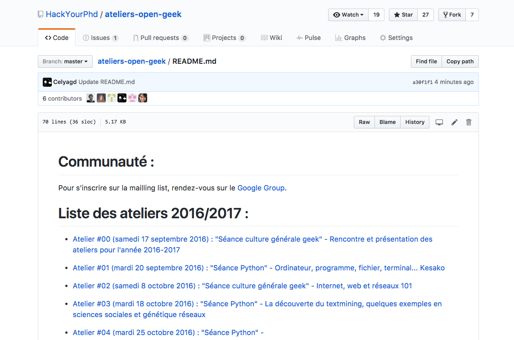
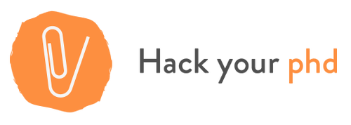

*Click ! and go directly to the french or the english version*

1. [Français](#français)
  - [HackYourPhD](#hackyourphd)
  - [DRISS](#DRISS)
2. [English](#english)
3. [Presentations](#presentations)

### Français 

## HackYourPhD 

J'ai cofondé [HackYourPhD](hackyourphd.org) une communauté *Open Science* en janvier 2013 avec [Guillaume Dumas](http://www.extrospection.eu/) chercheur à l'institut Pasteur en neurosciences. HackYourPhD s'est structuré en association (loi 1901) en Août 2014.

### Nos missions

HackYourPhD :

- partage des  **actualités sur l'Open Science** par le biais d'une veille collaborative sur les réseaux sociaux, principalement [Facebook](https://www.facebook.com/groups/499463776745202/) et [Twitter](https://twitter.com/hackyourphd) ;

- organise **des évènements** en France; notamment des ateliers introductifs et des débats sur l'*Open Science* (cf. notre page événement en [français](http://hackyourphd.org/evenements/) et en [anglais](http://hackyourphd.org/en/event/)). Nous menons depuis 2014 des **ateliers de formation au code** (python) [Open Geek](http://hackyourphd.org/ateliers-open-geek/)



[Page Github](https://github.com/HackYourPhd/ateliers-open-geek) avec le contenu des séances

- produit des **contenus en ligne** pour faire découvrir différentes facettes de l'*Open Science* et les différents profils qui y participent. Le blog HackYourPhD contient divers articles, interviews mais aussi des formats plus originaux pour communiquer à ce sujet (e.g. [flyers](http://hackyourphd.org/en/flyers/)), [ebook](http://hackyourphd.org/wp-content/uploads/2016/04/Ebook_Final_VF_LD.pdf) ;

Nous sommes en contact avec d'autres organisations impliquées dans cette thématique : Mozilla Science Lab, Software Carpentry, Open Knowledge Foundation, Right to Research, Open Con, FOSTER, La Paillasse, etc.

<figure>
    
</figure>

### A la rencontre des acteurs de l'*Open Science*

#### HackYourPhD USA et Québec


Avec HackYourPhD, j'ai débuté une première exploration de la thématique *Open Science* / Science ouverte [au Québec](http://hackyourphd-quebec.strikingly.com/). Durant l'été 2013, j'ai réalisé un grand tour des USA pour rencontrer des acteurs clefs de l'*Open Science* et mieux comprendre les racines de ce mouvement. Ce projet [HackYourPhD aux States](http://hackyourphd-aux-states.strikingly.com/) a été financé par une campagne de financement participatif (*crowdfunding)*. Toutes les ressources, interviews, carnet de voyage sont en ligne sur le site.

#### Livre : Portraits de jeunes chercheurs de la génération #OpenScience

Un livre a été publié en ligne suite au voyage HackYourPhDUSA. Il est disponible en [français](http://hackyourphd.org/wp-content/uploads/2016/04/Ebook_Final_VF_LD.pdf) et en [anglais](http://hackyourphd.org/wp-content/uploads/2016/04/Ebook_Final_ENG-ld.pdf)

#### Interviews _Open Science_


Découvrez plus de 80 interviews d'acteurs Open Science sur le profil HackYourPhD d'[archive.org](https://archive.org/search.php?query=HackYourPhD%22&sort=-downloads)

#### Quelques évènements et ateliers organisés

- [Ateliers Open Geek](http://hackyourphd.org/ateliers-open-geek/) Session 2016-2017 en cours.
- [Hackathon HackRepNum 2015](http://hackyourphd.org/2015/11/hackrepnum-un-hackathon-recherche-autour-de-la-loi-sur-le-numerique-samedi-12-decembre-a-la-paillasse/)
- Open Access Week 2014, 2015
- Atelier Open Science à la Cité des Sciences
- et plus ==> [sur notre page évènement HackYourPhD](http://hackyourphd.org/evenements/)

## DRISS (Digital Research in Science & Society) 

En 2019, j'ai crée avec Constance de Quatrebarbes une société [DRISS](https://driss.org/) (_Digital Research in Science & Society_). En premier lieu, cela nous a permis d'offrir des formations auprès d'universités et d'écoles de l'ESR. Ces formations modulaires et ancrées dans des immersions pratiques ont pour objet de donner des clefs de compréhension de l'_open_ et de la _data science_ tout en développant un regard critique et réflexif sur les transformations qu'apporte le numérique.

------

### English 

## HackYourPhD

I cofounded [HackYourPhD](hackyourphd.org) an Open Science community in january 2013 with [Guillaume Dumas](http://www.extrospection.eu/) researcher in Neuroscience at Pasteur Institute.
HackYourPhD became a non-profit organization (association loi 1901) in August 2014.

### What are our missions?

HackYourPhD :


- shares **news about Open Science** through a collective daily curation on social networks in both French and English ([Facebook Group](https://www.facebook.com/groups/499463776745202/), [Twitter](https://twitter.com/hackyourphd)


- organizes **events** in France; especially workshops about targeted topics or introductions and debates about Open Science (cf. our events page in [French](http://hackyourphd.org/evenements/) and in [English](http://hackyourphd.org/en/event/)). We have been organizing specific workshops **to learn programming with python** : [Open Geek ](http://hackyourphd.org/ateliers-open-geek/)



- produces **contents** to help researchers and students to understand what is Open Science and how they can participate. HackYourPhD blog contains various articles but also creative format to communicate about Open Science (e.g. [flyers](http://hackyourphd.org/en/flyers/))

We are connected with other organizations: Mozilla Science Lab, Software Carpentry, Open Knowledge Foundation, Right to Research, Open Con, FOSTER, etc.


<figure>
    
</figure>

### Open Science explorations

#### HackYourPhD : States and Quebec

With HackYourPhD, I did a first Open Science [exploration in Québec](http://hackyourphd-quebec.strikingly.com/) then I did an Open Science tour across the USA during the Summer 2013 to meet the key Open Science actors and gather information about the roots of the movement. This project [HackYourPhD aux States](http://hackyourphd-aux-states.strikingly.com/) was successfully funded by crowd funding. All the resources, interviews, travel log are openly available on our website.

#### Book : Profile of young researchers from the #OpenScience generation

We published an ebook based on the HackYourPhDUSA journey. It is available in [French](http://hackyourphd.org/wp-content/uploads/2016/04/Ebook_Final_VF_LD.pdf) and in [English](http://hackyourphd.org/wp-content/uploads/2016/04/Ebook_Final_ENG-ld.pdf)

#### Open Science interviews

You can find more than 70 interviews of Open Science actors on [archive.org](https://archive.org/search.php?query=HackYourPhD%22&sort=-downloads)

## DRISS (Digital Research in Science & Society)

At the crossroads of the worlds of research, entrepreneurship and society, [DRISS](https://driss.org/) (Digital Research in Science & Society) creates synergies to reveal and mobilize the best of your organizations' digital and human potential.

Our actions provide **guidance, training and equipment for effective digital changes** :

- Modular training courses rooted in practical immersions (learning and acculturation through "learning by doing", development of technical, methodological and reflective skills to increase autonomy).
- Strategic, organizational and technical consulting: development of human and collective potential (agile and participatory methodology), management of digital ethical and legal issues (GDPR, IPR and open), development of a digital environment adapted to open and data science)
- Development and assistance in open source software project management.

----

## Présentations 

*Ci-dessous, les présentations sont en anglais et en français.*

### 2019

- Juillet 2019 - Paris - [Quels enjeux pour l'open science en droit](https://openlaw.fr/evenement/quels-enjeux-pour-lopen-science-en-droit) - Open Law

- Juin 2019 - Paris - Cycle « Sciences et réseaux sociaux » – Session 2 : [Les réseaux sociaux, véritables objets de recherches scientifiques](https://socialmediaclub.fr/2019/06/04/cycle-sciences-et-reseaux-sociaux-session-2-les-reseaux-sociaux-veritables-objets-de-recherches-scientifiques/) - Social Media Club

### 2017-2018

zzzzz- Doctorat en cours - un peu de recul nécessaire sur mon engagement militant...zzzz

### 2016

- 24 Novembre 2016 - Paris - Adaweek : Table-ronde : [Entre utopie scientifique et réalités d'aujourd'hui :quel avenir pour l'open science ? Définition, mise en oeuvre des communs scientifiques](https://adaweek2016.sched.org/event/8Xwq/entre-utopie-scientifique-et-realites-daujourdhui-quel-avenir-pour-lopen-science-definition-mises-en-oeuvre-des-communs-scientifiques?iframe=no)

- 7 Novembre 2016 - Montpellier - Séminaire Doctoral : L'*Open Access* et moi organisé par les doctorant(e)s du CIRAD et de l'INRA (UMR Innovation et MOISA)

- 17 Aout 2016 - Seoul (Korea) - Presentation "Opening Science : from Society to Art" with Guillaume Dumas at [Unmake Lab](https://www.facebook.com/fab.unmake/?pnref=story) . Slides [ici](http://www.slideshare.net/gdumas/opening-science-from-society-to-art)

- 4 février 2016 - Paris - Meet-up Epidemium : Que se cache-t-il derrière cette ère de l'*Open* ? [Note de la présentation et des questions](http://bit.ly/1OWV8b9)

### 2015

- 4 juin 2015 - Paris - Wikistage SoScience
Comment concilier Open Science et recherche responsable ? [Video](http://www.wikistage.org/comment-concilier-open-science-et-recherche-responsable-celya-gruson-daniel-wikistage-soscience_d27e5bde0.html)

- 13-15 novembre 2015 - Bruxelles - OpenCon2015

- 16-17 septembre 2015 - Geneva - OKCon

### 2014

- 15-17 novembre 2015 - Washington DC - OpenCon2014

- 18 octobre 2014 - Metz - Assises du Journalisme
Table-ronde "Vulgariser l'information scientifique" aux [8e Assises du Journalisme](http://www.journalisme.com/)

- 26 septembre 2014 - Chamonix - CHAM 2014
Débat ["Citoyens : Comment accéder à l'Open Data ? »](http://www.canalcham.fr/fr/videos)

- 21-26 juin - Copenhagen - ESOF2014
ESOF 2014 ["Think Global, Act Local : how to empower your scientific community"](https://storify.com/HackYourPhd/esof2014-day-1-think-global-act-local-how-to-enga)

- 13 juin - Dijon - TEDxDijon
[Open Science, quand la recherche s'ouvre à la société](https://www.youtube.com/watch?v=E7ZmQ50b9jE&index=6&list=PLn3z9MbzvmAY1QxD97aASShLKGu1t4_zf) avec Guillaume Dumas

- 5 juin- Paris - Forum Changer d'ère
Table ronde ["Manager la complexité pour sur-vivre"](http://www.forumchangerdere.fr/ledition-2013-2) avec Joel de Rosnay, Geneviève Ferone, Blanche Segrestin

- 21 mai - Lanester - Forum Camp'TIC ""Solidarités et numérique"
Le Mouvement de l’Open Science : vers une réappropriation collective des connaissances et une conception plurielle de l’économie des connaissances. [Programme](http://www.camptic.info/2014/solidarites-et-numerique/programme/)

- 14 mars  - Paris - SoData
[Open Data : défis et enjeux en recherche](http://fr.slideshare.net/cgrusondaniel/so-data-open-data-dfis-et-enjeux-en-recherche) à [SoData](http://sodata.org/)

### 2013

- 8 juin - Paris - TEDxParisUniversités
[Thèse ou pas thèse ? Découverte de l'Open Science](https://www.youtube.com/watch?v=Xpe0qh_HKJE) (english subtitles)

- 5 juin - Paris - Forum Changer d'ère - Table ronde ["Désolé pour le dérangement, les makers sont entrain de changer le monde"](http://www.forumchangerdere.fr/programme-juin-2014) avec Cyril Lage, Jennifer Leblond, Francis Lorentz
