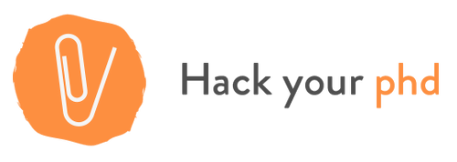

## HackYourPhD 

I cofounded [HackYourPhD](hackyourphd.org) an Open Science community in january 2013 with [Guillaume Dumas](http://www.extrospection.eu/) researcher in Neuroscience. 
HackYourPhD became a non-profit organization (association loi 1901) in August 2014.

###What are our missions?
 
HackYourPhD :

- shares **news about Open Science** through a collective daily curation on social networks in both French and English ([Facebook Group](https://www.facebook.com/groups/499463776745202/), [Twitter](https://twitter.com/hackyourphd)

- organizes **events** in France; especially workshops about targeted topics or introductions and debates about Open Science (cf. our events page in [French](http://hackyourphd.org/evenements/) and in [English](http://hackyourphd.org/en/event/)).


- produces **contents** to help researchers and students to understand what is Open Science and how they can participate. HackYourPhD blog contains various articles but also creative format to communicate about Open Science (e.g. [flyers](http://hackyourphd.org/en/flyers/))


<figure>
    
</figure>

We are connected with other organizations: Mozilla Science Lab, Software Carpentry, Open Knowledge Foundation, Right to Research.

###Open Science explorations

####HackYourPhD : States and Quebec

With HackYourPhD, I did a first Open Science [exploration in Québec](http://hackyourphd-quebec.strikingly.com/) then I did an Open Science tour across the USA during the Summer 2013 to meet the key Open Science actors and gather information about the roots of the movement. This project [HackYourPhD aux States](http://hackyourphd-aux-states.strikingly.com/) was successfully funded by crowd funding. All the resources, interviews, travel log are openly available on our website.


#### Open Science Interviews

You can find more than 70 interviews of Open Science actors on [HackYourPhD soundcloud](soundcloud.com/hackyourphd). 



---

## Presentations

###2015

####4 Juin 2015 - Paris - Wikistage SoScience
Comment concilier Open Science et recherche responsable ? [Video](http://www.wikistage.org/comment-concilier-open-science-et-recherche-responsable-celya-gruson-daniel-wikistage-soscience_d27e5bde0.html)

###2014

####18 Octobre 2014 - Metz - Assises du Journalisme
Table-ronde "Vulgariser l'information scientifique" aux [8e Assises du Journalisme](http://www.journalisme.com/)

####26 Septembre 2014 - Chamonix - CHAM 2014 
Débat ["Citoyens : Comment accéder à l'Open Data ? »](http://www.canalcham.fr/fr/videos) 

####June 21-26 - Copenhagen - ESOF2014
ESOF 2014 ["Think Global, Act Local : how to empower your scientific community"](https://storify.com/HackYourPhd/esof2014-day-1-think-global-act-local-how-to-enga)

####13 juin - Dijon - TEDxDijon
[Open Science, quand la recherche s'ouvre à la société](https://www.youtube.com/watch?v=E7ZmQ50b9jE&index=6&list=PLn3z9MbzvmAY1QxD97aASShLKGu1t4_zf) avec Guillaume Dumas 

####5 juin- Paris - Forum Changer d'ère
Table ronde ["Manager la complexité pour sur-vivre"](http://www.forumchangerdere.fr/ledition-2013-2) avec Joel de Rosnay, Geneviève Ferone, Blanche Segrestin

####21 mai - Lanester - Forum Camp'TIC ""Solidarités et numérique"
Le Mouvement de l’Open Science : vers une réappropriation collective des connaissances et une conception plurielle de l’économie des connaissances. [Programme](http://www.camptic.info/2014/solidarites-et-numerique/programme/)

####14 mars  - Paris - SoData
[Open Data : défis et enjeux en recherche](http://fr.slideshare.net/cgrusondaniel/so-data-open-data-dfis-et-enjeux-en-recherche) à [SoData](http://sodata.org/)

###2013 

####8 juin - Paris - TEDxParisUniversités
[Thèse ou pas thèse ? Découverte de l'Open Science](https://www.youtube.com/watch?v=Xpe0qh_HKJE) (english subtitles)

####5 juin - Paris - Forum Changer d'ère

Table ronde ["Désolé pour le dérangement, les makers sont entrain de changer le monde"](http://www.forumchangerdere.fr/programme-juin-2014) avec Cyril Lage, Jennifer Leblond, Francis Lorentz

---

## Events

###International participation 

####November 15-17 - Washington DC - OpenCon2014
- Summary Day 1 ([am](https://storify.com/HackYourPhd/opencon2014-first-day)/[pm](https://storify.com/HackYourPhd/opencon2014-panel))- Day 2 ([am](https://storify.com/HackYourPhd/opencon2014)/[pm](https://storify.com/HackYourPhd/opencon2014-how-to-make-your-research-open)
- Article [OpenCon 2014 : In the heart of Open Science advocacy](http://hackyourphd.org/en/2014/11/open-con2014-in-the-heart-of-open-science-advocacy/)

####June 21-26 - Copenhagen - ESOF2014
Summary Day [1](https://storify.com/HackYourPhd/esof2014-day-1-think-global-act-local-how-to-enga), [2](https://storify.com/HackYourPhd/esof2014-day-2-what-is-a-phd-for-in-2014-and-open), [3](https://storify.com/HackYourPhd/esof2014-day-3-big-data-business-and-science), [4](https://storify.com/HackYourPhd/esof2014-day-4-citizen-science-open-access), [5](https://storify.com/HackYourPhd/esof2014-day-5-should-science-always-be-open)

####September 16-17 - Geneva - OKCon
Summary Day [1](https://storify.com/HackYourPhd/okcon-openscience-at-the-open-knwoledge-conferenc), [2](https://storify.com/HackYourPhd/okcon-openscience-at-the-open-knowledge-conferenc), [3](https://storify.com/HackYourPhd/okcon-openscience-at-the-open-knowledge-conferenc-1) and [bonus](https://storify.com/HackYourPhd/okcon-from-open-data-to-open-science-policy-liter)

###Organization (main events)

Open Access Week 2014, Open Geek Workshops, Atelier Open Science à la Cité des Sciences and more... ==> [HackYourPhD website](http://hackyourphd.org/evenements/)

